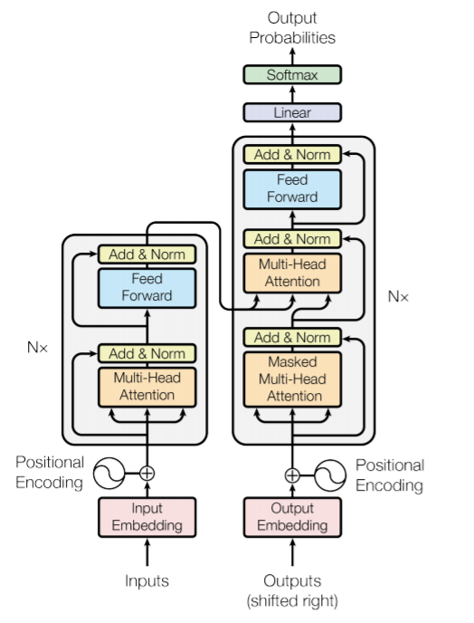

---
# Required front matter
layout: post # Posts should use the post layout
title: Transformer in Computer Vision # Post title
date: 2021-07-10 # Publish date in YYYY-MM-DD format

# Recommended front matter
tags: CV tag4 # A list of tags
splash_img_source: 
splash_img_caption:

# Optional front matter
updated: # Updated date in YYYY-MM-DD format
author: Xin Yi
name: Some Guest Author # Author name, if not provided defaults to site.author.name
homepage: # Author link, if not provided defaults to site.author.homepage
pin: false # true if this post must be pinned on top of the page, default is false.
listed: true # false if this post must NOT be included on the posts page, sitemap, and any of the tag pages, default is true
index: true # When false, <meta name="robots" content="noindex"> is added to the page, default is true
---

If you have to pick up a trendy word in 2021's in the world of computer vision, what would you choose? My answer is vision transformer. The transformer archietecture has achieved state of the art in many NLP tasks and inspired many researchers to adopt it in computer vision. Nowadays, the attention-based transformer module is shaking the dominating position of convolution. In this post, I will share some of  my understanding in transformer, especially its application in computer vision.

# What is Transformer

Transformer is first introduced in [Attentino Is All You Need](https://papers.nips.cc/paper/2017/file/3f5ee243547dee91fbd053c1c4a845aa-Paper.pdf). It is based on sef-attention and multi-head attention, which I have introduced in this [post]().  The model architecture is a encoder-decoder structure, using stacked self-attention and point-wise fully connected layers.

**Encoder:**

- Composed of N=6 identical layers
- Each layer has two sub-layer: Multi-head attention layer and feed-forward layer. 
- Residual connection is applied around each sub-layer, followed by layer normalization. That is, the output of each sub-layer is $$\textrm{Layernorm}(x+\textrm{Sublayer}(x))$$
- The output dimension $$d_{model}=512$$

**Decoder:**

- Composed of N=6 identical layers
- Each layer has three sub-layer: Masked multi-head attention layer in addition to previous two sub-layers.
- Residual connection and layernorm to each sub-layer.

Masked multi-head attention is because the output in position i can only depends on output positions before i.

The position-wise feed-forward network contains two linear function and a ReLU activition in between.

$$\mathrm{FFN}(x)=\max(0,xW_1+b_1)W_2+b_2$$

Sefl-attention based Tranformer models generally operate in two-stage learning mechanism.

- Pre-training on a large-scale dataset in supervised or unsupervised manner.
- Adapt pre-trained weights to downstream tasks using small datasets.

Since manually acquring labels for large datasets is costive, self-supervised learning has been very effectively used pre-trained stage.

Different from regular convolutional networks where features are aggregated and transformed simultaneously, the transformer perform aggregation in self-attention layers and transformation in feed forward layers.

