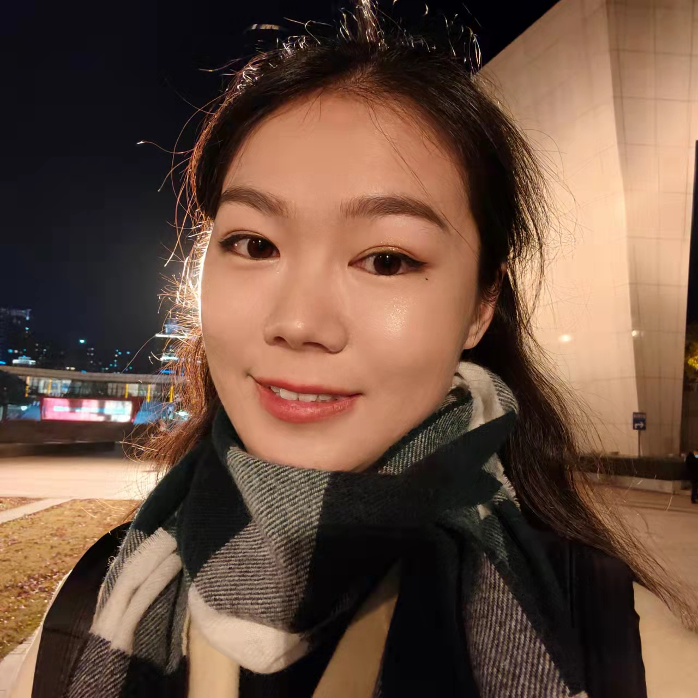

 

<h3 id="index_h2">About Me</h3>

	

		
	

	

        
My name is <b>Xin Yi(祎欣)</b>, a sophomore student in Huazhong University of Science and Technology(HUST) in Computer Science.

        
My interest lies in computer vision, recommender system, and other machine learning projects for social goods. Previously, I joined the AI π group under the supervision of professor He Kun, studying few shot learning. Here is my <a href="https://drive.google.com/file/d/1hXHD-Nqyw_YcLDAjYjoTIcZFSVLJRPoU/view?usp=sharing">resume</a>.

	

<h3 id="index_h2">Expierence</h3>

  

    <ul>
      <li>
        on-going
        

          <h3>📰 News App for Visually Impaired People</h3>
          
 Training offline deep learning recommendation model and deploying model on cloud service.

          
 Building data pipline in online model serving. 

        

      </li>

      <li>
        Feb-Mar 2022
        

          <h3>🍀 CardiC: Carbon Credit Assessment Platform </h3>
          
Built the front-end part of product exchange mall.

          
Used OCR techniques and customized rules to identify and quantify low carbon activities.

          
Constructed garbage classification system using Efficient Net model.

        

      </li>
      <li>
        Feb 2022
        

          <h3>🌲 Forest Assesment in ICM/MCM 2022 Contest</h3>
          
Modeled and stimulated the dynamic forest growth with Markov chain.

          
Designed customized harvesting strategy for different types of forest using CART Decision Tree. 

        

      </li>
      
      <li>
        Aug 2021
        

          <h3>👩 Microsoft Research Asia Ada Camp</h3>
          
 Learned the methodology of computer science research, cultivated an opening mindset for research, and gained insight in cutting-edge artificial intelligence research.

        

      </li>
      
      <li>
        Nov 2020 - present
        

          <h3>👩‍💻 AI Pai Machine Learning Team</h3>
          
Implemented several computer vision models using PyTorch, including image style transfer(SqueezeNet), image caption(VGG-16 & LSTM) and hand-written digits generation(DC-GAN).
          

        

      </li>
      <li>
        Jul 2020
        

          <h3>🙌 Bingyan Studio Front-end Intern</h3>
          
 Learned front-end developing basics and built a to-do list app with Vue.js framework which allows flexible task management with the features of progress tracking and deadline reminder.
          

        

      </li>
    </ul>
  

<h3 id="index_h2">Miscellaneous</h3>

	<ul>
		<li>🤝 I love working with people from different backgrounds because it always makes me learn new thoughts and freshen my perspective.</li>
		<li>🐶 I used to volunteer at Wuhan Stray Dog Rescue Center, taking care of stray dogs and maintaining facilities. </li>
		<li>🐱 I have a lovely black cat called Mimi. He can cure all of your unhappiness with just a single "meow". </li>
		<li>🎾 I am learning tennis currently. Before this, I have played 8 years ping-pong. </li>
		<li>🎶 I am a huge Lana Del Rey fan. She's a true artist(I'm serious) and a free therapist(I'm joking).</li>
	</ul>

 
 
 
 